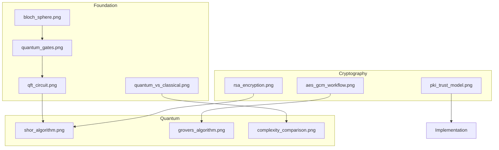

# Image Reference Guide
[[thesis_overview|← Back to Overview]] | [[docs/index|← Documentation Index]]

#documentation #figures

## Image Organization by Chapter

### Foundation Layer (85-90%)

#### Chapter 1: Introduction
- `quantum_vs_classical.png`
  - Location: src/images/01_Introduction/
  - Usage: Section 1.2 - Paradigm shift visualization
  - Related: Ch.4 computational models

#### Chapter 2: Quantum Fundamentals
- `bloch_sphere.png`
  - Location: src/images/02_Fundamentals_of_Quantum_Computing/
  - Usage: Section 2.1 - Qubit visualization
  - Related: Basic quantum states

- `quantum_gates.png`
  - Location: src/images/02_Fundamentals_of_Quantum_Computing/
  - Usage: Section 2.3 - Gate operations
  - Related: Circuit model computing

- `qft_circuit.png`, `qpe_circuit.png`
  - Location: src/images/02_Fundamentals_of_Quantum_Computing/
  - Usage: Section 2.4 - Algorithm components
  - Related: Ch.5 Shor's algorithm

#### Chapter 3: Classical Cryptography
- `rsa_encryption.png`
  - Location: src/images/03_Classical_Cryptography/
  - Usage: Section 3.2 - Public key encryption
  - Related: Ch.5 quantum threats

- `aes_gcm_workflow.png`
  - Location: src/images/03_Classical_Cryptography/
  - Usage: Section 3.1 - Symmetric encryption
  - Related: Ch.6 hybrid systems

- `pki_trust_model.png`
  - Location: src/images/03_Classical_Cryptography/
  - Usage: Section 3.4 - Infrastructure
  - Related: Ch.7 transition planning

### Analysis Layer (75-80%)

#### Chapter 4: Classical vs Quantum
- `complexity_comparison.png`
  - Location: src/images/04_Classical_vs_Quantum_Computing/
  - Usage: Section 4.2 - Performance analysis
  - Related: Ch.5 algorithm speedups

#### Chapter 5: Quantum Impact
- `shor_algorithm.png`
  - Location: src/images/05_Quantum_Impact_on_Cryptography/
  - Usage: Section 5.1 - RSA vulnerability
  - Related: Ch.6 motivation

- `grovers_algorithm.png`
  - Location: src/images/05_Quantum_Impact_on_Cryptography/
  - Usage: Section 5.2 - Symmetric impact
  - Related: Ch.6 key sizes

### Solutions Layer (55-60%)

#### Chapter 6: Quantum-Resistant Cryptography
- Focus on CRYSTALS-Kyber and Classic McEliece implementations
- Diagrams showing lattice-based and code-based approaches
- Integration with existing PKI systems

#### Chapter 7: PQC Transition Challenges
- Implementation case studies
- NIST standardization timeline
- Migration strategy flowcharts

### Conclusion (10%)
- Synthesis diagrams integrating previous concepts
- Future research direction visualizations

## Image Relationships


## Usage Guidelines

### LaTeX Integration
```latex
% Basic usage
\includegraphics[width=0.8\textwidth]{chapter_name/image_name}

% With figure environment
\begin{figure}[htbp]
    \centering
    \includegraphics[width=0.8\textwidth]{chapter_name/image_name}
    \caption{Descriptive caption}
    \label{fig:unique_label}
\end{figure}
```

### Best Practices
1. Store images in appropriate chapter folders
2. Use consistent naming conventions
3. Maintain backup copies in src/images/temp_backup/
4. Reference figures using \ref{fig:label}

### Cross-References
- Link figures to concepts in [[concept_map|Concept Map]]
- Track figure usage in [[chapter_dependencies|Chapter Dependencies]]
- Document changes in [[thesis_workflow|Workflow Guide]]

## Tags
#figures #documentation #thesis