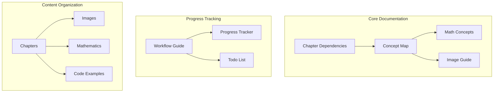

# Documentation Index
[[thesis_overview|← Back to Overview]]

#documentation #index

## Core Documentation
- [[chapter_dependencies|Chapter Dependencies]] - Chapter structure and relationships (Updated)
- [[concept_map|Concept Map]] - Key terms and their interconnections
- [[thesis_workflow|Thesis Workflow]] - Development and compilation process
- [[image_reference_guide|Image Guide]] - Figure management and usage
- [[math_concepts|Mathematical Concepts]] - Theorems and mathematical dependencies

## Project Management
- [[../progress_tracker|Progress Tracker]] - 68% Overall completion
  - Foundation Layer: 85-90%
  - Analysis Layer: 75-80%
  - Solutions Layer: 55-60%
  - Conclusion: 10%
- [[thesis_todo|Todo List]] - Current priorities:
  - Complete CRYSTALS-Kyber implementation details
  - Expand NIST standardization process coverage
  - Begin conclusion chapter synthesis

## Project Structure
- [[../Chapters|Chapter Index]] - Main chapter organization
- [[../comp|Compilation]] - Build process overview
- [[../thesis_overview|Project Overview]] - High-level thesis structure

## Documentation Maps

## Image Organization
- Foundation Layer (Ch.1-3)
  - Quantum principles visualization
  - Cryptographic workflows
  - Basic concepts

- Analysis Layer (Ch.4-5)
  - Comparative diagrams
  - Algorithm illustrations
  - Impact assessments

- Solutions Layer (Ch.6-7)
  - PQC implementations
  - Transition workflows
  - Case studies

## Mathematical Framework
- Quantum Mechanics
- Cryptography Theory
- Complexity Analysis
- PQC Foundations

## Tags Navigation
- #documentation - All documentation files
- #workflow - Process and compilation
- #concepts - Key terms and relationships
- #mathematics - Theorems and proofs
- #figures - Images and diagrams
- #structure - Project organization
- #thesis - General thesis content
- #cryptography - Cryptographic concepts
- #quantum-computing - Quantum computing topics
- #post-quantum-cryptography - PQC specific content