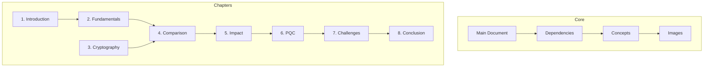

# Thesis Overview
#thesis #overview

## Document Organization
- [[main.tex|Main Document]]
- [[preamble.tex|Document Preamble]]
- [[Chapters|Chapter Index]]
- [[comp|Compilation]]

## Core Content Structure
- [[docs/chapter_dependencies|Chapter Dependencies & Flow]]
- [[docs/concept_map|Concept Map]]
- [[docs/thesis_workflow|Workflow Guide]]
- [[progress_tracker|Progress Tracking]]
- [[docs/math_concepts|Mathematical Concepts]]
- [[docs/image_chapter_links|Image Relationships]]

## Chapter Navigation & Resources
### Foundation (85-90% Complete)
- [[src/chapters/01_introduction|1. Introduction]] (85%)
  - Images: [[src/images/01_Introduction/quantum_vs_classical.png|Quantum vs Classical]]

- [[src/chapters/02_fundamentals|2. Quantum Fundamentals]] (85%)
  - Images: [[src/images/02_Fundamentals_of_Quantum_Computing/bloch_sphere.png|Bloch Sphere]], [[src/images/02_Fundamentals_of_Quantum_Computing/quantum_gates.png|Quantum Gates]]

- [[src/chapters/03_classical_crypto|3. Classical Cryptography]] (90%)
  - Images: [[src/images/03_Classical_Cryptography/rsa_encryption.png|RSA]], [[src/images/03_Classical_Cryptography/pki_trust_model.png|PKI Model]]

### Core Analysis (75-80% Complete)
- [[src/chapters/04_classical_vs_quantum|4. Classical vs Quantum]] (75%)
  - Images: [[src/images/04_Classical_vs_Quantum_Computing/complexity_comparison.png|Complexity Classes]]

- [[src/chapters/05_quantum_impact|5. Quantum Impact]] (80%)
  - Images: [[src/images/05_Quantum_Impact_on_Cryptography/grovers_algorithm.png|Grover]], [[src/images/05_Quantum_Impact_on_Cryptography/shor_algorithm.png|Shor]]

### PQC & Challenges (55-60% Complete)
- [[src/chapters/06_quantum_resistant|6. Quantum-Resistant Cryptography]] (55%)
  - CRYSTALS-Kyber and Classic McEliece focus

- [[src/chapters/07_challenges|7. Challenges in PQC Transition]] (60%)
  - Implementation case studies and NIST updates

### Conclusion (10% Complete)
- [[src/chapters/08_conclusion|8. Conclusion]]
  - Integration of broader implications and future research

## Project Maps

### Documentation Structure

## Key Resources
- [[docs/thesis_workflow|Project Workflow]]
- [[docs/image_reference_guide|Image Guide]]
- [[progress_tracker|Progress Status]] (Overall: 68%)

## Tags
#thesis #quantum-computing #cryptography #post-quantum-cryptography #documentation